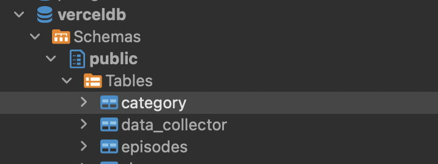

The product that I am developing is called “Podify”, a podcast app. Podify will be a web application which will allow users to stream and listen to podcasts. Podify will cover a wide range of podcasts on topics of interest for the target audience. Users will have access to podcasts that are categorized by specific genres, like arts, business, comedy, education and fiction.

## Getting Started

1. Install Nodejs and Yarn
2. Run yarn install
3. Add .env.development.local file – Please add the following env variables

NEXT_PUBLIC_APP_URL=
POSTGRES_DATABASE=
POSTGRES_HOST=
POSTGRES_PASSWORD=
POSTGRES_PRISMA_URL=
POSTGRES_URL=
POSTGRES_URL_NON_POOLING=
POSTGRES_URL_NO_SSL=
POSTGRES_USER=
QSTASH_URL=
QSTASH_TOKEN=
QSTASH_CURRENT_SIGNING_KEY=
QSTASH_NEXT_SIGNING_KEY=

For Week 3 Assignment,

Please make a POST request to http://localhost:3000/api/setup/categories-week3-assign

It first creates a table - categories
Then fetches data from external Spreaker API https://api.spreaker.com/v2/show-categories
Please visit https://final-project-csca-5028.vercel.app/ to see the fetched data.

Code for the API is under app/api/setup/categories-week3-assign

